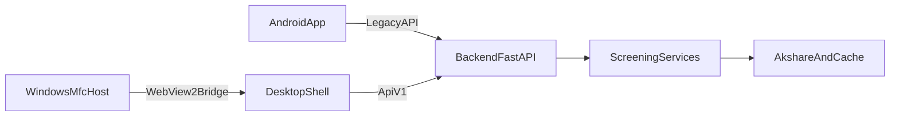

# Client Compatibility Architecture

## Objective

在同一仓库中同时维护 Android 客户端与 Windows 10 MFC + WebView2 客户端，并共享同一套 FastAPI 选股后端。

## Repository Boundaries

- `backend/`: 共享后端能力与 API
- `android-app/`: Android 现有客户端
- `windows-mfc/`: Windows 原生宿主
- `web/desktop-shell/`: WebView2 承载的桌面前端壳层
- `docs/`: 契约、架构、版本策略与验收文档

## Compatibility Principles

1. Android 旧接口优先稳定，不因 Windows 接入而改变既有行为。
2. Windows 优先接入 `/api/v1/*`，不反向挤压 Android 升级节奏。
3. 核心业务逻辑只保留一份，在 `backend/app/services/` 中共享。
4. 客户端差异只允许出现在：
   - UI 层
   - 本地缓存层
   - 客户端日志/诊断层

## Data Flow

## Shared Guarantees

- 共享同一套筛选服务：`ScreenerService`
- 共享同一套数据抓取与缓存策略：`AkshareDataService`
- 共享同一交易日、策略标签和核心字段口径

## Deliberate Differences

- Android：保持当前按钮级 2 小时结果缓存
- Windows：优先提供宿主级日志、配置和调试能力
- Windows 首版通过 WebView2 承载壳层页面，降低纯 MFC UI 首轮实现成本
